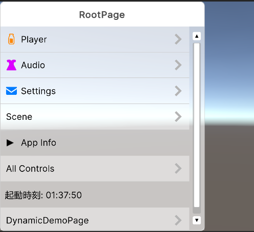

# デバッグメニュー<br>自作してみた

<p class="subtitle">F2F クライアント 平塚</p>

<!--
F2Fクライアントの平塚です
今回は「デバッグメニュー自作してみた」という題で発表させていただきます
作ったもの自体だけじゃなくて、UIToolkitについても触れる予定です
-->

---

## 何を作ったのか

<div class="grid-2">
  <div>
    <p class="big-message">階層式の<br>デバッグメニュー</p>
    <div class="stack">
      <div class="stack-row accent">3回タップで起動</div>
      <div class="stack-row">ページ単位で整理</div>
      <div class="stack-row">Runtime / EditorWindow 両対応</div>
    </div>
  </div>
  <figure class="image-frame">
    
  </figure>
</div>

<!--
で。今回何を作ったのかと言うと...【実演】
階層式のデバッグメニューですね
3回タップで出ます
こんな感じで階層メニューになってます
動的にUIを追加できます
カスタムテーマ機能もあって、ダークモードにしたりとか
エディタウィンドウ版もあります
-->

---

<p class="section-kicker">Public API</p>

## 使い方

<p class="lead"><code>DebugPage</code> を継承して、<code>Configure</code> を override する</p>

<div class="grid-2">
  <div class="mini-card"><h3>DebugPage</h3><p>1ページ分のUI</p></div>
  <div class="mini-card"><h3>Configure</h3><p>中身をC#で組む</p></div>
</div>
<br>

```csharp
public sealed class BattleDebugPage : DebugPage
{
    public override void Configure(IDebugUIBuilder builder)
    {
        builder.Label("Battle");
        builder.IntegerField("Enemy Id", 0, x => enemy.Hp = x);
        builder.Button("Spawn", () => Enemy.Spawn());
    }
}
```

<!--
軽く使い方について説明すると
DebugPageっていうクラスがあって
それを継承したクラスを作る
で、それのConfigureメソッドをoverrideする。

いくつかこだわりポイントがあって
-->

---

## Builder API

<p class="lead"><code>Label</code> や <code>IntegerField</code> は拡張メソッド</p>

<div class="grid-3">
  <div class="mini-card"><h3>VisualElement</h3><p>概ね何でも追加できる</p></div>
  <div class="mini-card"><h3>Extensions</h3><p>標準UIは薄く呼ぶ</p></div>
  <div class="mini-card"><h3>Foldout</h3><p>中身も Builder で組む</p></div>
</div>
<br>

```csharp
public override void Configure(IDebugUIBuilder builder)
{
    builder.Label("Battle");
    builder.IntegerField("Enemy Id", 0, x => enemy.Hp = x);

    builder.Foldout("Actions", b =>
    {
        b.Label("Admin actions");
        b.Button("Create", () => Actions.Create(););
    });
}
```

<!--
1つ目 BuilderAPI
Configureの引数で渡されるIDebugUIBuilderってのが、前提VisualElementなら概ね何でも追加できるような感じになっていて
このLabelとかIntegerFieldみたいなメソッドは全て薄くラップした拡張メソッドになってます
なので、ユーザーの拡張性は高いかなと
あとは、Foldoutに渡してるラムダなんですが、Actionの引数が同じIDebugUIBuilderになってるのがちょっと面白ポイントです
-->

---

<p class="section-kicker">Feature</p>

## UIの動的追加

<p class="lead">追加時に返る <code>IDisposable</code> を dispose すると、そのUIは消える</p>

<div class="grid-3">
  <div class="mini-card"><h3>AddDebugUI</h3><p>ページ末尾に追加</p></div>
  <div class="mini-card"><h3>IDisposable</h3><p>追加したUIを削除</p></div>
  <div class="mini-card"><h3>AddTo(enemy)</h3><p>寿命に紐づける</p></div>
</div>
<br>

```csharp
var page = DebugMenu.GetPage<BattleDebugPage>();

page.AddDebugUI(builder =>
{
    builder.Slider("Enemy HP", enemy.Hp.Value, 0, enemy.MaxHp, x => enemy.Hp.Value = x);
}).AddTo(enemy);
```

<!--
次に2つ目 UIの動的追加
これはConfigure時じゃなくても、ページインスタンスを取得したうえで、AddDebugUIなどのメソッドで後からUIを追加できますというやつです
で、このとき返るIDieposableをDisposeすると、削除されます
例えば特定の敵のHPを操作するデバッグコマンドを追加して、AddToで敵の寿命に紐づけてDisposeされるようにする、みたいなことやりたいなと思い、作りました
-->

---

## EditorWindow

<div class="flow-3">
  <div class="node accent"><strong>Runtime</strong><span>ゲーム画面上で表示</span></div>
  <div class="arrow">&gt;</div>
  <div class="node"><strong>DebugPage</strong><span>同一インスタンスを移動</span></div>
  <div class="arrow">&gt;</div>
  <div class="node green"><strong>EditorWindow</strong><span>Editor側で操作</span></div>
</div>

<div class="callout top-gap">内部的には、Runtime 側から引っこ抜いて EditorWindow に差し替えるような作り</div>

<!--
最後に3つ目 EditorWindow
あらためてお見せすると...【実演】
このように、ランタイム側と同じデバッグメニューを、エディタウィンドウとして表示できます
これは内部実装的には、DebugPageは本当に同一インスタンスで。ランタイム側から引っこ抜いてエディタウィンドウにぶっ挿してるような感じになってます
画面を隠さずにデバッグメニューを使えるのはいいところかなと
-->

---

<p class="section-kicker">Motivation</p>

## そもそも、なぜ自作したのか

<div class="grid-2">
  <div class="card"><h3>既存の選択肢はある</h3><p>SRDebugger / UnityDebugSheet など、似たことができるものは存在する</p></div>
  <div class="card"><h3>ただ、不満もある</h3><p>階層、見た目、拡張手順、Editor併用をまとめて揃えたかった</p></div>
</div>

<!--
で。そもそも、なぜ自作したのか、という話なんですけど
似たようなことができる既存の選択肢というのはあります。先に述べたこだわりポイントも動機の１つとつではあったんですが
ただ、既存の選択肢にはいくつか不満もありました
-->

---

## 既存ライブラリへの不満

<div class="grid-2">
  <div class="card">
    <h3>SRDebugger</h3>
    <p>階層メニューが作れないと、デバッグコマンドまみれになりがち</p>
  </div>
  <div class="card">
    <h3>UnityDebugSheet</h3>
    <p>かなり良い正直これでいいただ、細かい不満はある</p>
  </div>
</div>

<div class="grid-3 top-gap">
  <div class="mini-card"><h3>見た目</h3><p>ボタンがボタンっぽく見えにくい</p></div>
  <div class="mini-card"><h3>拡張</h3><p>できるが手続きが少し重い</p></div>
  <div class="mini-card"><h3>テーマ</h3><p>見た目だけ変えるにも手を入れたい</p></div>
</div>

<!--
SRDebuggerは、階層メニューが作れないので、デバッグコマンドまみれになって視認性が悪くなりがちという問題があります
UnityDebugSheetは、その点かなりいいです。ぶっちゃけこれでいいまである。ただ不満はいくつかあって。ボタンのデザインが致命的にボタンっぽく見えなさすぎるとか、拡張はできるけどちょっと面倒な手続きが多いとか。
-->

---

## 一方で本パッケージは

<div class="grid-4">
  <div class="mini-card"><h3>UI Toolkit</h3><p>VisualElement をそのまま扱える</p></div>
  <div class="mini-card"><h3>拡張</h3><p>Prefab 登録のような手続きはいらない</p></div>
  <div class="mini-card"><h3>見た目</h3><p>テーマ USS を差し替える</p></div>
  <div class="mini-card"><h3>C# 不要</h3><p>見た目だけならコードを触らない</p></div>
</div>

<div class="quote-box top-gap">
  <p>拡張は C# から、見た目は USS から触れるようにした</p>
</div>

<!--
その辺、本パッケージはUIToolkitを使用しているので、拡張するにあたってプレハブを登録しとく必要とかないし、見た目変えたいだけならそもそもC#いじらなくていい
あとは細かいところなんですが、UnityDebugSheet、UIを追加するメソッドの引数が無駄に多い感が否めなくて、しかもオプショナル引数まみれなんで、書きにくいとかもあるんですよね。この点IDebugUIBuilderは結構上手く行ってるつもりです
-->

---

<p class="section-kicker">UI Toolkit</p>

## 長所と短所

<div class="grid-2">
  <div class="card"><h3 class="ok">良い</h3><p>AIエージェントとの相性はかなり良い</p></div>
  <div class="card"><h3 class="ng">厳しい</h3><p>作り込むほど内部実装との格闘が増える</p></div>
</div>

<!--
で。ここからはUIToolkitを採用してみた感想パートとなります。
UIToolkit、良いところもあるんですが正直厳しいなという点も多くて。
-->

---

## 良いところ: AIエージェントとの相性

<div class="grid-3">
  <div class="card"><h3>UXML</h3><p>結局ただのテキストファイル</p></div>
  <div class="card"><h3>USS</h3><p>見た目の差分をテキストで扱える</p></div>
  <div class="card"><h3>Diff</h3><p>変更点をレビューしやすい</p></div>
</div>

<div class="quote-box top-gap">
  <p>UGUI より、AI が高い精度でレイアウトを組みやすい</p>
</div>

<!--
良いところは、今の時代としては何と言っても、AIエージェントとの相性の良さですね。
UGUIと比べれば、圧倒的にこちらの方が高い精度でレイアウトを組んでくれます。uxmlは結局ただのテキストファイルですからね。レビューもしやすい。
-->

---

## UGUI と比べたときの効率

<div class="grid-3">
  <div class="mini-card"><h3>構造</h3><p>階層をテキストで見られる</p></div>
  <div class="mini-card"><h3>見た目</h3><p>USSだけで調整しやすい</p></div>
  <div class="mini-card"><h3>トークン</h3><p>Prefab操作より軽く済みやすい</p></div>
</div>

<div class="callout top-gap">UniCLI などで UGUI をゴリ押し生成するより、少ないやり取りで形にしやすい</div>

<!--
効率もすごくいい。UniCLIとか使ってゴリ押しでUGUI作るときよりもはるかにスムーズだしトークン消費少なく済みます
-->

---

<p class="section-kicker">Issues</p>

## ただ、罠もだいぶ多かった

<div class="grid-4">
  <div class="mini-card"><h3>USS</h3><p>背景色が標準テーマに負ける</p></div>
  <div class="mini-card"><h3>Button</h3><p>Clickable がイベントを止める</p></div>
  <div class="mini-card"><h3>Slider</h3><p>ClampedDragger がイベントを握る</p></div>
  <div class="mini-card"><h3>Hidden</h3><p>初回表示の負荷が出る</p></div>
</div>

<div class="callout danger top-gap">結果から言うと、エンタープライズ開発のランタイムUIに使うのは保守が厳しいと思った</div>

<!--
ただ厳しいのが、罠もだいぶ多かったってことです
結果から述べると、エンタープライズでの開発において、ランタイムUIに使うのは保守が無理かなと
-->

---

## USS で background-color を制御しきれない

<div class="flow-3">
  <div class="node warn"><strong>:hover</strong><span>標準テーマに<br>上書きされる</span></div>
  <div class="arrow">&gt;</div>
  <div class="node warn"><strong>!important</strong><span>期待通り<br>勝てない</span></div>
  <div class="arrow">&gt;</div>
  <div class="node green"><strong>C#</strong><span>inline style で<br>直接反映</span></div>
</div>

<div class="grid-3 top-gap">
  <div class="mini-card"><h3>やりたいこと</h3><p>hover / press の背景色変更</p></div>
  <div class="mini-card"><h3>色定義</h3><p>USS custom property</p></div>
  <div class="mini-card"><h3>状態反映</h3><p><code>style.backgroundColor</code></p></div>
</div>

<div class="callout top-gap">ここから Button / Slider のイベント問題につながった</div>

<!--
まず「USSでbackground-colorを制御しきれない」。これはカスタムテーマを実装するときの入口で詰まったところです
最初は CSS みたいに、USS の hover に背景色を書けば終わりだと思っていました
ただ実際には、Unity のデフォルトテーマ側が背景色を上書きしてきたり、!importantを付けても期待通りには勝てなかったりして、USSだけではhoverやpress中の背景色を安定して制御できませんでした
なので色の定義はUSSに置きつつ、実際に背景色を変えるところはC#側でinline styleを入れる形にしました

で、そうなると次に必要になるのが、押した、離した、hoverした、みたいな状態をC#で取ることなんですが、ここでもかなりハマりました
-->

---

## Button: PointerDown イベントが取れない

<div class="grid-2">
  <div>
    <p class="big-message">標準 <code>Button</code> の <code>Clickable</code> 内部で押下が止まる</p>
  </div>
  <div class="mono-diagram">
Button<br>
└─ Clickable<br>
&nbsp;&nbsp;&nbsp;└─ PointerDownEvent<br>
&nbsp;&nbsp;&nbsp;&nbsp;&nbsp;&nbsp;└─ <span class="ng">StopImmediatePropagation()</span>
  </div>
</div>

<div class="grid-3 compact-grid">
  <div class="mini-card"><h3>BubbleUp</h3><p>0 のまま</p></div>
  <div class="mini-card"><h3>TrickleDown</h3><p>増える</p></div>
  <div class="mini-card"><h3>clicked</h3><p>増える</p></div>
</div>

<!--
まず「PointerDownイベントが届かない」
ボタンを押している間だけ色を変えて、離したら元に戻そうとしたところ、PointerDownイベントを取ることができなくて。これ何故かというと、Buttonのクリック処理を担当しているClickableの内部実装でPointerDownEventを処理していて、そこでイベントを止めてるからです。けどButtonはVisualElementには違いないので、普通にコールバックが取れそうなコードがコンパイルを通るという。罠ですよね。
-->

---

## Button 対策: Clickable を差し替える

<div class="flow-3">
  <div class="node accent"><strong>Press</strong><span>OnPressed</span></div>
  <div class="arrow">&gt;</div>
  <div class="node"><strong>Clickable</strong><span>base 処理へ渡す</span></div>
  <div class="arrow">&gt;</div>
  <div class="node green"><strong>Release</strong><span>OnReleased</span></div>
</div>

```csharp
button.clickable = new InteractiveClickable();

clickable.OnPressed  += ApplyActiveColor;
clickable.OnReleased += RestoreHoverColor;
```

<div class="callout top-gap">普通にイベントを購読するのではなく、標準部品の内部実装に入り込む必要があった</div>

<!--
結果として、Clickable を継承する自作クラスを作って、ButtonのClickableにセットして上書きするという対応をしました
-->

---

## Slider: PointerUp イベントが取れない

<div class="grid-2">
  <div>
    <p class="big-message"><code>ClampedDragger</code> により解放を拾えない</p>
    <div class="grid-2 compact-grid">
      <div class="mini-card"><h3>Down</h3><p class="ok">取れる</p></div>
      <div class="mini-card"><h3>Up</h3><p class="ng">取れない</p></div>
    </div>
  </div>
  <div class="mono-diagram">
ScrollView<br>
└─ Slider<br>
&nbsp;&nbsp;&nbsp;└─ ClampedDragger<br>
&nbsp;&nbsp;&nbsp;&nbsp;&nbsp;&nbsp;└─ PointerUpEvent<br>
&nbsp;&nbsp;&nbsp;&nbsp;&nbsp;&nbsp;&nbsp;&nbsp;&nbsp;└─ <span class="ng">StopImmediatePropagation()</span>
  </div>
</div>

<div class="callout top-gap">値変更ではなく、drag 中の見た目を戻すために必要だった</div>

<!--
次に「PointerUpイベントが取れない」。
これ何故かというと、ScrollViewのスクロールバーで使われているSliderの内部実装で、Buttonと同じようなことが起きている感じでした
-->

---

## Slider 対策: PointerCaptureOut を使う

<div class="flow-3">
  <div class="node accent"><strong>Down</strong><span>親 Slider の<br>TrickleDown</span></div>
  <div class="arrow">&gt;</div>
  <div class="node"><strong>Drag</strong><span>active 色を<br>維持</span></div>
  <div class="arrow">&gt;</div>
  <div class="node green"><strong>Release</strong><span>PointerCaptureOut</span></div>
</div>

```csharp
slider.RegisterCallback<PointerDownEvent>(
    OnDraggerDown, TrickleDown.TrickleDown);

slider.RegisterCallback<PointerCaptureOutEvent>(_ => OnRelease());
dragger.RegisterCallback<PointerCaptureOutEvent>(_ => OnRelease());
```

<div class="callout top-gap">PointerUp そのものではなく、キャプチャ解除を drag 終了として扱った</div>

<!--
なので最終的には PointerUp ではなく、PointerCaptureOut を「ドラッグ終了」として扱う実装にしました
-->

---

## 色を変えたいだけなのに...

<div class="flow-3">
  <div class="node"><strong>USS</strong><span>色の定義</span></div>
  <div class="arrow">&gt;</div>
  <div class="node warn"><strong>C#</strong><span>状態管理と<br>inline style</span></div>
  <div class="arrow">&gt;</div>
  <div class="node warn"><strong>内部実装</strong><span>Clickable /<br>ClampedDragger</span></div>
</div>
<br>
<p class="big-message">やりたいことは背景色変更だけなのに、イベント伝播と標準部品の内部実装まで見ることになった</p>
<br>
<div class="callout danger top-gap">テーマ調整が USS で完結できず、結局 C# が必要</div>

<!--
この話をまとめると、やりたかったことは「テーマをちょっと変えたい」「背景色を変えたい」だけなんですが、結局、内部実装を見に行ってC#側の実装がいるっていう。
-->

---

## 最適化: 初回表示のスパイクを抑える

<div class="flow-3">
  <div class="node"><strong>期待</strong><span>非表示中の処理を<br>止めたい</span></div>
  <div class="arrow">&gt;</div>
  <div class="node warn"><strong>実際</strong><span>表示時に処理が<br>寄ることがある</span></div>
  <div class="arrow">&gt;</div>
  <div class="node accent"><strong>採用</strong><span>画面外 translate +<br>事前アタッチ</span></div>
</div>

```csharp
style.translate =
    new StyleTranslate(
        new Translate(-5000, -5000));

style.opacity = 0f;
```

<div class="callout warn top-gap">公式の hide 方法のトレードオフを踏まえ、この用途では表示時の体感を優先した</div>

<!--
あと一応、最適化について行った工夫についても
display:noneを使うと、レイアウト計算が飛ばされるので、初回表示時にスパイクすることがあります
なので、画面外の滅茶苦茶遠くへtranslateしておくという方法を取ることで、レイアウト計算をゲーム開始タイミングに寄せることができ、フレーム落ちを確実に回避できるようになりました
ちなみにこれ、Unity公式のリファレンスに乗ってる手法なんですね
-->

---

## 結言

<div class="grid-2">
  <div class="card"><h3 class="ok">UI Toolkit × AI</h3><p>UXML / USS はテキストなので、エージェントとの往復が軽い。個人開発やツール UI なら積極的に使える</p></div>
  <div class="card"><h3 class="ng">内部実装との格闘</h3><p>Clickable・ClampedDragger・標準テーマの上書き。驚き最小の原則の逆を行く罠が多い</p></div>
</div>

<div class="grid-3 top-gap">
  <div class="mini-card"><h3>個人開発</h3><p>トラブルを AI に丸投げできるならアリ</p></div>
  <div class="mini-card"><h3>ツール UI</h3><p>用途を絞れば強いテキスト資産</p></div>
  <div class="mini-card"><h3>大規模 Runtime</h3><p>チーム保守前提では慎重に</p></div>
</div>

<!--
UIToolkitはAIエージェントとの相性については本当に良い
ただ、罠が多すぎる。基本的に驚き最小の原則の逆張りをしていて、内部実装との格闘が多すぎて、これは厳しい。
個人開発で、UIToolkitのトラブルは全てAIエージェント+上位モデルにお任せする、とかならアリなのかもしれない。
-->
