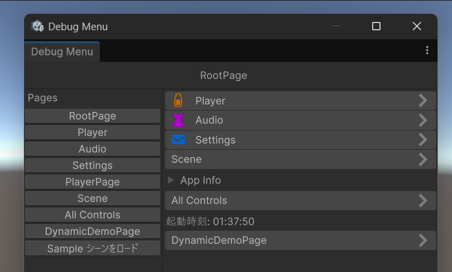
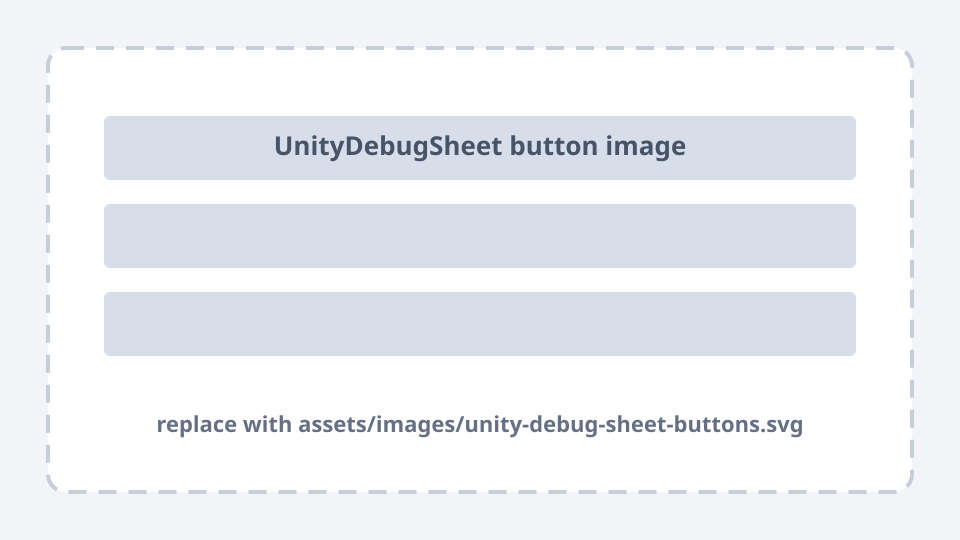

# デバッグメニュー<br>自作してみた

<p class="subtitle">F2F クライアント 平塚</p>

---

## 今日の流れ

<div class="flow-4">
  <div class="node accent"><strong>作ったもの</strong><span>Runtime<br>EditorWindow</span></div>
  <div class="arrow">&gt;</div>
  <div class="node"><strong>使い方</strong><span>DebugPage<br>Initialize<br>Configure</span></div>
  <div class="arrow">&gt;</div>
  <div class="node green"><strong>動機</strong><span>既存ライブラリ<br>不満</span></div>
  <div class="arrow">&gt;</div>
  <div class="node warn"><strong>UI Toolkit</strong><span>良かった点<br>課題点</span></div>
</div>

---

<p class="section-kicker">Part 1 / Public API</p>

## 使い方

<div class="flow-3">
  <div class="node accent"><strong>DebugPage</strong><span>ページを作る</span></div>
  <div class="arrow">&gt;</div>
  <div class="node"><strong>Initialize</strong><span>Root を渡して起動</span></div>
  <div class="arrow">&gt;</div>
  <div class="node green"><strong>Configure</strong><span>Builder でUIを追加</span></div>
</div>

<div class="callout">基本は3つ</div>

---
class: code-diagram-slide
---

## 1. `DebugPage` を作る

```csharp
public sealed class BattleDebugPage : DebugPage
{
    public override void Configure(IDebugUIBuilder builder)
    {
        // UI definition goes here.
    }
}
```

<div class="diagram side-diagram">
  <h3>DebugPage の役割</h3>
  <div class="stack">
    <div class="stack-row accent">1ページ = 1クラス</div>
    <div class="stack-row">用途ごとにページを分ける</div>
    <div class="stack-row">中身は Configure に書く</div>
  </div>
</div>

---
class: initialize-slide
---

## 2. `Initialize` で起動する

```csharp
var root = new RootPage();

DebugMenu.Initialize(root);
```

<p class="small muted">必要なら <code>PanelSettings</code> も渡せる。</p>

<div class="flow-2 side-flow">
  <div class="node accent"><strong>RootPage</strong><span>最初に表示するページ</span></div>
  <div class="arrow">&gt;</div>
  <div class="node green"><strong>DebugMenu</strong><span>Runtime メニューとして初期化</span></div>
</div>

---
class: configure-slide
---

## 3. `Configure` でUIを組み立てる

```csharp
public override void Configure(IDebugUIBuilder builder)
{
    builder.Label("Repository test");
    builder.IntegerField("Id");

    builder.Foldout("Actions", b =>
    {
        b.Label("Admin actions");
        b.PrimaryButton("Create", Create);
        b.DangerButton("Delete", Delete);
    });
}
```

<div class="api-panel">
  <h3>Builder サポートするUI</h3>
  <div class="api-grid">
    <div class="mini-card"><h3>Text</h3><p>Label / TextField</p></div>
    <div class="mini-card"><h3>Number</h3><p>Integer / Float</p></div>
    <div class="mini-card"><h3>Button</h3><p>Primary / Danger</p></div>
    <div class="mini-card"><h3>Layout</h3><p>Foldout / HorizontalScope</p></div>
  </div>
</div>

---
class: dynamic-ui-slide
---

## 動的にUIを追加する

<div class="grid-3">
  <div class="mini-card"><h3>AddDebugUI</h3><p>ページ末尾にUIを後から追加。</p></div>
  <div class="mini-card"><h3>PlaceBehind</h3><p>既存UIの前後に差し込む。</p></div>
  <div class="mini-card"><h3>Dispose</h3><p>追加したUIを削除する。</p></div>
</div>

```csharp
var page = DebugMenu.GetPage<BattleDebugPage>();

page.AddDebugUI(ui =>
{
    var slider = ui.Slider(
        "Enemy HP", enemy.Hp.Value, 0, enemy.MaxHp,
        value => enemy.Hp.Value = value);

    enemy.Hp.Subscribe(hp => slider.value = hp)
        .AddTo(enemy);
}).AddTo(enemy);
```

---

## Runtime / EditorWindow 両対応

<div class="split-banner">
  <div class="banner">
    <h3>Runtime</h3>
    <p>ゲーム画面上に表示。</p>
    <p class="small muted">実機に近い操作感で確認する。</p>
  </div>
  <div class="banner">
    <h3>EditorWindow</h3>
    <p>同じ DebugPage を借用。</p>
    <p class="small muted">ゲーム画面を隠さず操作する。</p>
  </div>
</div>
</br>
<div class="callout">同一 <code>DebugPage</code> インスタンスを Runtime と EditorWindow の間で移し替えて表示する。</div>

---

## Runtime 表示

<div class="grid-2">
  <div>
    <p class="lead">ゲーム画面上で、その場の状態を見ながら操作する。</p>
    <div class="stack">
      <div class="stack-row accent">実機に近い確認</div>
      <div class="stack-row">タッチ操作</div>
      <div class="stack-row">マウスホイール操作</div>
    </div>
  </div>
  <figure class="image-frame">
    
  </figure>
</div>

---

## EditorWindow 表示

<div class="grid-2">
  <div>
    <p class="lead">ゲーム画面を隠さず、Unity Editor 側で同じメニューを触る。</p>
    <div class="stack">
      <div class="stack-row accent">画面を占有しない</div>
      <div class="stack-row">同じ DebugPage</div>
      <div class="stack-row">Editor 作業と併用</div>
    </div>
  </div>
  <figure class="image-frame">
    
  </figure>
</div>

---

## 高いカスタマイズ性

<div class="split-banner customization">
  <div class="banner">
    <h3>UIごと変えたい</h3>
    <p>VisualElement であれば、大体自由に配置できるようになっている。</p>
    <div class="stack compact-stack">
      <div class="stack-row accent">標準UI</div>
      <div class="stack-row accent">+カスタムUI</div>
    </div>
  </div>
  <div class="banner">
    <h3>見た目だけ変えたい</h3>
    <p>テーマのカスタマイズだけで済む。</p>
    <div class="stack compact-stack">
      <div class="stack-row accent">色</div>
      <div class="stack-row accent">余白</div>
      <div class="stack-row accent">ボタンやフィールドの見た目</div>
    </div>
  </div>
</div>

<div class="callout">見た目だけならC#をいじる必要さえない</div>

---

<p class="section-kicker">Part 2 / Motivation</p>

## なぜ自作したのか

<div class="grid-2">
  <div class="card"><h3>SRDebugger</h3><p>実績のあるデバッグメニュー系アセット。</p></div>
  <div class="card"><h3>UnityDebugSheet</h3><p>階層メニュー式のデバッグUIライブラリ。</p></div>
</div>
</br>
<div class="callout">既存の選択肢は、ある</div>

---

## SRDebugger: コマンドまみれになる

<div class="grid-2">
  <div>
    <p class="small muted">SRDebuggerで並ぶデバッグコマンドの例。</p>
    <div class="stack">
      <div class="stack-row command player">Player / Add Exp</div>
      <div class="stack-row command player">Player / Reset</div>
      <div class="stack-row command enemy">Enemy / Spawn</div>
      <div class="stack-row command quest">Quest / Clear</div>
      <div class="stack-row command network">Network / Reconnect</div>
    </div>
  </div>
  <div>
    <p class="lead">デバッグコマンドを階層化できないと、項目が増えるほど視認性が落ちる。</p>
  </div>
</div>

---

## UnityDebugSheet: 階層化はされている

<p class="subhead">ただ細かい不満はある</p>

<div class="grid-2">
  <figure class="image-frame">
    
    <figcaption>差し替え想定: <code>assets/images/unity-debug-sheet-buttons.svg</code></figcaption>
  </figure>
  <div class="stack">
    <div class="mini-card"><h3>Add 系 API</h3><p>オプショナル引数が多く、少し書きにくい。</p></div>
    <div class="mini-card"><h3>ボタン</h3><p>見やすさのデザインが好みと違う。</p></div>
    <div class="mini-card"><h3>スクロール</h3><p>マウスホイールよりドラッグ操作に寄る。</p></div>
  </div>
</div>

---

## 本パッケージで解決したかったこと

<div class="grid-3">
  <div class="card"><h3>階層メニュー</h3><p>項目が増えても用途ごとに探せる。</p></div>
  <div class="card"><h3>テーマ</h3><p>見た目の不満はカスタムテーマで吸収。</p></div>
  <div class="card"><h3>UI Toolkit</h3><p>スワイプもマウスホイールも自然。</p></div>
</div>

<div class="callout">拡張ボタンを増やさなくても、テーマだけでかなり寄せられる。</div>

---

<p class="section-kicker">Part 3 / Good Points</p>

## UI Toolkit はツールUIと相性が良い

<div class="grid-3">
  <div class="card"><h3>C# で構築</h3><p>動的UIを作りやすい。</p></div>
  <div class="card"><h3>構造化</h3><p>VisualElement ツリーで扱える。</p></div>
  <div class="card"><h3>USS</h3><p>見た目を分離できる。</p></div>
</div>

---

## 良かった点: C# から動的に作れる

<div class="flow-3">
  <div class="node accent"><strong>状態</strong><span>選択中 / 通信結果</span></div>
  <div class="arrow">&gt;</div>
  <div class="node"><strong>Builder</strong><span>必要な UI を追加</span></div>
  <div class="arrow">&gt;</div>
  <div class="node green"><strong>操作</strong><span>その場で検証</span></div>
</div>

<div class="callout">デバッグ用途では「あとから足せる」がかなり強い。</div>

---

## 良かった点: IMGUI より構造化しやすい

<div class="mono-diagram">
DebugPage<br>
└─ ScrollView<br>
&nbsp;&nbsp;&nbsp;├─ DebugLabel<br>
&nbsp;&nbsp;&nbsp;├─ DebugFoldout<br>
&nbsp;&nbsp;&nbsp;│&nbsp;&nbsp;├─ IntegerField<br>
&nbsp;&nbsp;&nbsp;│&nbsp;&nbsp;└─ Button Row<br>
&nbsp;&nbsp;&nbsp;└─ NavigationButton
</div>

<div class="callout">要素ツリーとして扱えるので、ページ・部品・状態リセットの責務を分けやすい。</div>

---

<p class="section-kicker">Part 4 / Issues</p>

## 実際に使って分かった課題点

<div class="grid-4">
  <div class="mini-card"><h3>Button</h3><p>押下イベントが素直に取れない</p></div>
  <div class="mini-card"><h3>Slider</h3><p>解放イベントが取れない</p></div>
  <div class="mini-card"><h3>USS</h3><p>C# 補助が必要</p></div>
  <div class="mini-card"><h3>Editor</h3><p>Runtime と同じではない</p></div>
</div>

<div class="callout warn">標準部品の見た目やイベントを深く触るほど、内部実装の理解が必要になる。</div>

---

## 課題点1: Button の PointerDown

<div class="grid-2">
  <div>
    <p class="big-message">標準 <code>Button</code> の BubbleUp では押下を拾えない。</p>
  </div>
  <div class="mono-diagram">
Button<br>
└─ Clickable<br>
&nbsp;&nbsp;&nbsp;└─ PointerDownEvent<br>
&nbsp;&nbsp;&nbsp;&nbsp;&nbsp;&nbsp;└─ <span class="ng">StopImmediatePropagation()</span>
  </div>
</div>

<div class="grid-3 compact-grid">
  <div class="mini-card"><h3>BubbleUp</h3><p>0 のまま</p></div>
  <div class="mini-card"><h3>TrickleDown</h3><p>増える</p></div>
  <div class="mini-card"><h3>clicked</h3><p>増える</p></div>
</div>

---
class: button-solution-slide
---

## Button 対策: Clickable を差し替える

<div class="flow-3">
  <div class="node accent"><strong>Press</strong><span>OnPressed</span></div>
  <div class="arrow">&gt;</div>
  <div class="node"><strong>Clickable</strong><span>base 処理へ渡す</span></div>
  <div class="arrow">&gt;</div>
  <div class="node green"><strong>Release</strong><span>OnReleased</span></div>
</div>

```csharp
button.clickable = new InteractiveClickable();
clickable.OnPressed  += ApplyActiveColor;
clickable.OnReleased += RestoreHoverColor;
```

---

## 課題点2: Slider の PointerUp

<div class="grid-2">
  <div>
    <p class="lead"><code>ScrollView</code> の dragger で、押下は取れるが解放が取れない。</p>
    <div class="grid-2 compact-grid">
      <div class="mini-card"><h3>Down</h3><p class="ok">取れる</p></div>
      <div class="mini-card"><h3>Up</h3><p class="ng">取れない</p></div>
    </div>
  </div>
  <div class="diagram">
    <h3>採用したシグナル</h3>
    <div class="node green">
      <strong>PointerCaptureOut</strong>
      <span>キャプチャ解放を release として扱う</span>
    </div>
  </div>
</div>

---

## 課題点3: USS だけでは足りない

<div class="flow-3">
  <div class="node warn"><strong>:hover</strong><span>背景色が<br>上書きされる</span></div>
  <div class="arrow">&gt;</div>
  <div class="node warn"><strong>!important</strong><span>期待通り<br>勝てない</span></div>
  <div class="arrow">&gt;</div>
  <div class="node green"><strong>C#</strong><span>inline style で<br>状態反映</span></div>
</div>

<div class="callout">色は USS、押下/解放の状態遷移は C# に分けた。</div>

---

## カスタムプロパティの罠

<div class="split-banner">
  <div class="banner">
    <h3 class="ng">NG</h3>
<pre><code>:root {
  --hover-color: #eee;
}</code></pre>
    <p>C# の <code>TryGetValue</code> では読めない。</p>
  </div>
  <div class="banner">
    <h3 class="ok">OK</h3>
<pre><code>.c-button--primary {
  --hover-color: #eee;
}</code></pre>
    <p>対象要素に直接マッチさせる。</p>
  </div>
</div>

---

## 課題点4: EditorWindow は別世界

<div class="grid-3">
  <div class="card"><h3>テーマ変数</h3><p>Runtime 側の <code>:root</code> がない。</p></div>
  <div class="card"><h3>BaseField</h3><p>Editor 組み込み USS に負ける。</p></div>
  <div class="card"><h3>TextElement</h3><p>パネル移動で縦位置がズレる。</p></div>
</div>

<div class="callout warn">同じ VisualElement でも、同じ見た目になるとは限らない。</div>

---

## 課題点5: 非表示管理と初回スパイク

<div class="flow-3">
  <div class="node warn"><strong>display:none</strong><span>配下の処理を<br>スキップ</span></div>
  <div class="arrow">&gt;</div>
  <div class="node warn"><strong>Show</strong><span>処理が<br>一気に走る</span></div>
  <div class="arrow">&gt;</div>
  <div class="node warn"><strong>Spike</strong><span>初回表示が<br>重くなる</span></div>
</div>

<div class="callout danger">デバッグメニューでは「開いた瞬間に重い」が一番困る。</div>

---
class: hidden-solution-slide
---

## 解決: 画面外 translate + 事前アタッチ

```csharp
style.translate =
    new StyleTranslate(
        new Translate(-5000, -5000));
style.opacity = 0f;
```

<div class="stack side-stack">
  <div class="stack-row accent">処理は進む</div>
  <div class="stack-row accent">画面外なので当たらない</div>
  <div class="stack-row accent">ページも先に attach</div>
</div>

<div class="callout"><code>UsageHints.DynamicTransform</code> で transform 更新コストも抑える。</div>

---

## まとめ

<div class="grid-3">
  <div class="card"><h3>向いている</h3><p>デバッグメニュー、設定画面、ツールUI。</p></div>
  <div class="card"><h3>作ってよかった</h3><p>Builder / Page / Host に分けた設計。</p></div>
  <div class="card"><h3>注意が必要</h3><p>標準部品のイベント、Editor 差分、非表示性能。</p></div>
</div>

<div class="quote-box">
  <p>UI Toolkit は便利。ただし、深く触るほど内部挙動を見る必要がある。</p>
</div>
