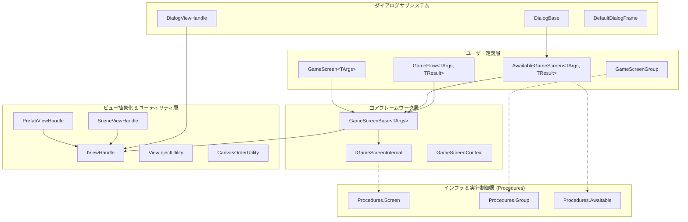

# lilja.screen-management

`lilja.screen-management` は、Unity 向けに設計された **Pure C#（MonoBehaviour 非依存）の宣言的画面遷移・管理フレームワーク** です。  
画面のビジネスロジックを Unity GameObject のライフサイクルから完全に分離し、テスタビリティの向上、状態管理の単純化、および柔軟なビューインジェクションを提供します。

---

## 1. 設計思想と特徴

### 核心的な設計原則

| 原則 | 実現アプローチ |
| :--- | :--- |
| **Pure C# による画面ロジック** | `GameScreenBase` は MonoBehaviour を継承せず、画面オブジェクトを Pure C# クラスとして定義します。これにより単体テストが容易になります。 |
| **ビューの遅延注入 (View Injection)** | `[View]` 属性を付与したフィールドやプロパティに対して、ロードされたビューのコンポーネントをリフレクションによって自動バインド（注入）します。 |
| **プレハブとシーンの透過性** | `IViewHandle` による抽象化により、プレハブベースの UI（Canvas）とシーンベースの UI を同じ画面制御 API から透過的に扱えます。 |
| **排他的な画面遷移グループ** | `GameScreenGroup` が「一度に1画面だけを表示する」排他制御を保証し、履歴スタックを用いた「戻る」操作をサポートします。 |
| **ダイアログサブシステム** | 呼び出し元が結果を非同期（`UniTask`）で待機可能な `DialogBase`（`AwaitableGameScreen`）の仕組みを提供します。 |
| **遷移演出の完全な分離** | `ITransition` を通じて画面遷移アニメーションを定義し、遷移元・遷移先の組み合わせに応じた演出の一時差し替え（オーバーライド）に対応します。 |
| **徹底した使い捨て設計** | 複雑な画面状態のリセット漏れを防ぐため、画面およびグループのインスタンスはすべて「使い捨て（再利用不可）」の設計思想を徹底しています。 |

### アーキテクチャ概要



---

## 2. 導入方法

### UPM (Unity Package Manager) からの導入

Unity プロジェクトの `Packages/manifest.json` の `dependencies` ブロックに以下を追加します。

```json
{
  "dependencies": {
    "com.cysharp.unitask": "https://github.com/Cysharp/UniTask.git?path=src/UniTask/Assets/Plugins/UniTask",
    "com.kamahiro.lilja.screen-management": "https://github.com/kamahir0/Lilja.git?path=lilja-packages/lilja.screen-management/src/Lilja.ScreenManagement"
  }
}
```

※ 必要に応じて Git URL の末尾に `#vX.Y.Z` のようにタグを指定してください。

### 前提依存パッケージ
- **UniTask** (`com.cysharp.unitask`)
- **R3** (`com.cysharp.r3`) ※ オプショナル統合に対応

---

## 3. 基本的な使い方

### 3.1. 画面の定義（GameScreen）

Pure C# クラスとして画面を定義し、UI コンポーネントを `[View]` 属性でバインドします。

```csharp
using System.Threading;
using Cysharp.Threading.Tasks;
using UnityEngine;
using UnityEngine.UI;
using Lilja.ScreenManagement;

// 画面に渡す引数用のレコードまたはクラス
public record MyScreenArgs(string Message);

// PrefabViewHandle を用いたプレハブベースの画面
public class MyGameScreen : GameScreen<MyScreenArgs>
{
    // ビューロード完了時に、対応する GameObject から自動的にバインドされます
    [View("Container/Text_Message")] private Text _messageText;
    [View("Container/Button_Close")] private Button _closeButton;

    protected override void OnViewLoaded()
    {
        // データの適用
        _messageText.text = Args.Message;

        // ボタンのインタラクション購読 (ライフサイクル内でクリーンアップされます)
        _closeButton.onClick.AddListener(() =>
        {
            // グループを通じて画面を戻す、または完了する
            Group.SwitchBackAsync().Forget();
        });
    }

    protected override UniTask OnEnterAsync(EnterType enterType, CancellationToken cancellationToken)
    {
        // 画面アクティブ化時の初期演出や初期化ロジック
        return UniTask.CompletedTask;
    }

    protected override UniTask OnExitAsync(ExitType exitType, CancellationToken cancellationToken)
    {
        // 画面非アクティブ化時の演出や終了処理
        return UniTask.CompletedTask;
    }
}
```

### 3.2. 画面グループの構築と呼び出し（GameScreenGroup）

`GameScreenGroup` は、排他的に切り替わる一連の画面群を管理します。

```csharp
using System;
using Cysharp.Threading.Tasks;
using Lilja.ScreenManagement;

public class MenuScreenGroup : GameScreenGroup
{
    protected override void Configure(IGameScreenGroupBuilder builder)
    {
        // 画面のキー名と生成ファクトリの登録
        builder.Register<MainMenuScreen, ValueTuple>(() => new MainMenuScreen());
        builder.Register<MyGameScreen, MyScreenArgs>(() => new MyGameScreen());
        
        // オプション: グループ固有のデフォルト遷移アニメーションの設定
        builder.SetDefaultTransition(new FadeTransition());
    }
}

// 呼び出し例
public class GameInitializer
{
    public async UniTask StartMenuAsync(GameScreenContext context)
    {
        var group = new MenuScreenGroup();
        
        // グループを呼び出し、初期画面を起動する
        // グループ全体の終了 (Complete) を待機可能なハンドルが返されます
        var handle = group.CallAsync(
            callerContext: context,
            initialScreenKey: typeof(MainMenuScreen).FullName,
            initialScreenArgs: default(ValueTuple)
        );

        await handle; // グループが正常終了するまで非同期待機
    }
}
```

### 3.3. ダイアログの呼び出しと結果待機（AwaitableGameScreen）

ダイアログなどの「結果の返却を待機したい画面」は、`AwaitableGameScreen<TArgs, TResult>` またはその派生である `DialogBase` を使用します。

```csharp
using System.Threading;
using Cysharp.Threading.Tasks;
using Lilja.ScreenManagement.Dialog;

public class ConfirmDialog : DialogBase<ConfirmDialogArgs, bool>
{
    // タイトルやボタンのレイアウト定義...

    protected override void Build()
    {
        Frame.SetTitle(Args.Title);
        Content.AddText(Args.Body);
        
        // OKボタン押下で true を返して完了
        Frame.AddButton("OK", () => Complete(true));
        
        // キャンセルボタン押下で false を返して完了
        Frame.AddButton("Cancel", () => Complete(false));
    }
}

// 呼び出し元での実装
public class DialogTrigger
{
    public async UniTask ShowConfirmDialogAsync(GameScreenContext context, CancellationToken ct)
    {
        var dialog = new ConfirmDialog();
        
        // ダイアログを表示し、ユーザーの決定結果を非同期で受け取る
        bool isOk = await dialog.CallAsync(
            callerContext: context,
            args: new ConfirmDialogArgs("警告", "本当に実行しますか？"),
            cancellationToken: ct
        );

        if (isOk)
        {
            // 承認時の処理
        }
    }
}
```

---

## 4. 堅牢な設計・最適化仕様

### 1. アニメーションキャンセルの安全性
ダイアログアニメーション等の演出処理中に非同期処理がキャンセル（`CancellationToken` の発火）された場合でも、UI が中途半端な透明度や位置で停止することを防ぐ **Snapback 構造** を採用しています。例外発生をキャッチし、即座に最終状態を強制的に適用（スナップ）してから安全に例外を上流へ再スローします。

### 2. Enter Play Mode Options (Domain Reload OFF) 完全対応
Unity の高速再生機能である「Domain Reload の無効化」に対応するため、`[RuntimeInitializeOnLoadMethod]` を用いた静的キャッシュ領域（リフレクションの型情報バッファ、生成シーン参照など）の自動クリア機構を完備しています。エディタ上での繰り返し再生においても不要な古いステートが干渉しません。

### 3. メモリと GC の配慮
画面遷移時の sorting order 適用ロジックにおいて、`Canvas` 参照の収集時に発生する `new List<Canvas>()` の GC アロケーションを排除しています。クラス内で再利用される共有静的バッファへの切り替えにより、遷移処理を高頻度で実行した場合でもガベージコレクションの発生を極小に抑えます。

---

## 5. 貢献およびライセンス

### 開発環境
- **Unity 6.3** またはそれ以降を推奨（Unity 2022.3 LTS 以上でも動作します）

### ライセンス
このパッケージは **MIT ライセンス** の下で公開されています。詳細については、プロジェクトの [LICENSE](LICENSE) ファイルを参照してください。
