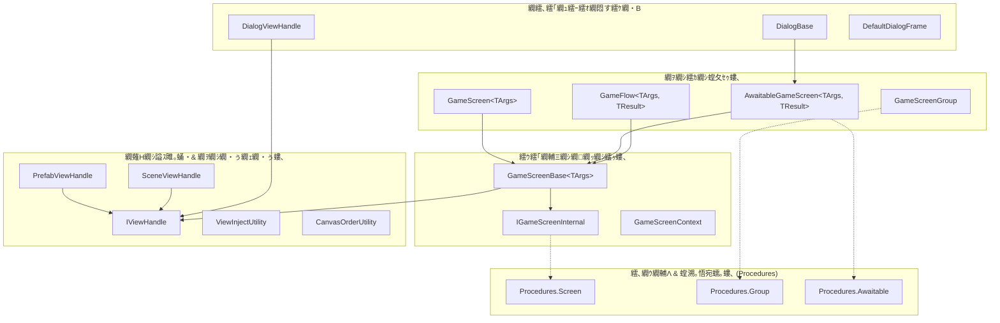

# lilja.screen-management

`lilja.screen-management` 縺ｯ縲ゞnity 蜷代￠縺ｫ險ｭ險医＆繧後◆ **Pure C#・・onoBehaviour 髱樔ｾ晏ｭ假ｼ峨・螳｣險€逧・判髱｢驕ｷ遘ｻ繝ｻ邂｡逅・ヵ繝ｬ繝ｼ繝繝ｯ繝ｼ繧ｯ** 縺ｧ縺吶€・ 
逕ｻ髱｢縺ｮ繝薙ず繝阪せ繝ｭ繧ｸ繝・け繧・Unity GameObject 縺ｮ繝ｩ繧､繝輔し繧､繧ｯ繝ｫ縺九ｉ螳悟・縺ｫ蛻・屬縺励€√ユ繧ｹ繧ｿ繝薙Μ繝・ぅ縺ｮ蜷台ｸ翫€∫憾諷狗ｮ｡逅・・蜊倡ｴ泌喧縲√♀繧医・譟碑ｻ溘↑繝薙Η繝ｼ繧､繝ｳ繧ｸ繧ｧ繧ｯ繧ｷ繝ｧ繝ｳ繧呈署萓帙＠縺ｾ縺吶€・
---

## 1. 險ｭ險域€晄Φ縺ｨ迚ｹ蠕ｴ

### 譬ｸ蠢・噪縺ｪ險ｭ險亥次蜑・
| 蜴溷援 | 螳溽樟繧｢繝励Ο繝ｼ繝・|
| :--- | :--- |
| **Pure C# 縺ｫ繧医ｋ逕ｻ髱｢繝ｭ繧ｸ繝・け** | `GameScreenBase` 縺ｯ MonoBehaviour 繧堤ｶ呎価縺帙★縲∫判髱｢繧ｪ繝悶ず繧ｧ繧ｯ繝医ｒ Pure C# 繧ｯ繝ｩ繧ｹ縺ｨ縺励※螳夂ｾｩ縺励∪縺吶€ゅ％繧後↓繧医ｊ蜊倅ｽ薙ユ繧ｹ繝医′螳ｹ譏薙↓縺ｪ繧翫∪縺吶€・|
| **繝薙Η繝ｼ縺ｮ驕・ｻｶ豕ｨ蜈･ (View Injection)** | `[View]` 螻樊€ｧ繧剃ｻ倅ｸ弱＠縺溘ヵ繧｣繝ｼ繝ｫ繝峨ｄ繝励Ο繝代ユ繧｣縺ｫ蟇ｾ縺励※縲√Ο繝ｼ繝峨＆繧後◆繝薙Η繝ｼ縺ｮ繧ｳ繝ｳ繝昴・繝阪Φ繝医ｒ繝ｪ繝輔Ξ繧ｯ繧ｷ繝ｧ繝ｳ縺ｫ繧医▲縺ｦ閾ｪ蜍輔ヰ繧､繝ｳ繝会ｼ域ｳｨ蜈･・峨＠縺ｾ縺吶€・|
| **繝励Ξ繝上ヶ縺ｨ繧ｷ繝ｼ繝ｳ縺ｮ騾城℃諤ｧ** | `IViewHandle` 縺ｫ繧医ｋ謚ｽ雎｡蛹悶↓繧医ｊ縲√・繝ｬ繝上ヶ繝吶・繧ｹ縺ｮ UI・・anvas・峨→繧ｷ繝ｼ繝ｳ繝吶・繧ｹ縺ｮ UI 繧貞酔縺倡判髱｢蛻ｶ蠕｡ API 縺九ｉ騾城℃逧・↓謇ｱ縺医∪縺吶€・|
| **謗剃ｻ也噪縺ｪ逕ｻ髱｢驕ｷ遘ｻ繧ｰ繝ｫ繝ｼ繝・* | `GameScreenGroup` 縺後€御ｸ€蠎ｦ縺ｫ1逕ｻ髱｢縺縺代ｒ陦ｨ遉ｺ縺吶ｋ縲肴賜莉門宛蠕｡繧剃ｿ晁ｨｼ縺励€∝ｱ･豁ｴ繧ｹ繧ｿ繝・け繧堤畑縺・◆縲梧綾繧九€肴桃菴懊ｒ繧ｵ繝昴・繝医＠縺ｾ縺吶€・|
| **繝€繧､繧｢繝ｭ繧ｰ繧ｵ繝悶す繧ｹ繝・Β** | 蜻ｼ縺ｳ蜃ｺ縺怜・縺檎ｵ先棡繧帝撼蜷梧悄・・UniTask`・峨〒蠕・ｩ溷庄閭ｽ縺ｪ `DialogBase`・・AwaitableGameScreen`・峨・莉慕ｵ・∩繧呈署萓帙＠縺ｾ縺吶€・|
| **驕ｷ遘ｻ貍泌・縺ｮ螳悟・縺ｪ蛻・屬** | `ITransition` 繧帝€壹§縺ｦ逕ｻ髱｢驕ｷ遘ｻ繧｢繝九Γ繝ｼ繧ｷ繝ｧ繝ｳ繧貞ｮ夂ｾｩ縺励€・・遘ｻ蜈・・驕ｷ遘ｻ蜈医・邨・∩蜷医ｏ縺帙↓蠢懊§縺滓ｼ泌・縺ｮ荳€譎ょｷｮ縺玲崛縺茨ｼ医が繝ｼ繝舌・繝ｩ繧､繝会ｼ峨↓蟇ｾ蠢懊＠縺ｾ縺吶€・|
| **蠕ｹ蠎輔＠縺滉ｽｿ縺・昏縺ｦ險ｭ險・* | 隍・尅縺ｪ逕ｻ髱｢迥ｶ諷九・繝ｪ繧ｻ繝・ヨ貍上ｌ繧帝亟縺舌◆繧√€∫判髱｢縺翫ｈ縺ｳ繧ｰ繝ｫ繝ｼ繝励・繧､繝ｳ繧ｹ繧ｿ繝ｳ繧ｹ縺ｯ縺吶∋縺ｦ縲御ｽｿ縺・昏縺ｦ・亥・蛻ｩ逕ｨ荳榊庄・峨€阪・險ｭ險域€晄Φ繧貞ｾｹ蠎輔＠縺ｦ縺・∪縺吶€・|

### 繧｢繝ｼ繧ｭ繝・け繝√Ε讎りｦ・


---

## 2. 蟆主・譁ｹ豕・
### UPM (Unity Package Manager) 縺九ｉ縺ｮ蟆主・

譛ｬ繝代ャ繧ｱ繝ｼ繧ｸ縺ｯ `UniTask` 縺ｫ萓晏ｭ倥＠縺ｦ縺・∪縺吶€６nity 縺ｮ莉墓ｧ伜宛髯撰ｼ医ヱ繝・こ繝ｼ繧ｸ閾ｪ霄ｫ縺ｮ `package.json` 縺ｫ Git URL 縺檎峩謗･險倩ｼ峨〒縺阪↑縺・ｼ峨↓繧医ｊ縲；it 邨檎罰縺ｧ繧､繝ｳ繝昴・繝医☆繧矩圀縺ｯ莉･荳九・縺・★繧後°縺ｮ譁ｹ豕輔〒萓晏ｭ倬未菫ゅｒ隗｣豎ｺ縺吶ｋ蠢・ｦ√′縺ゅｊ縺ｾ縺吶€・
#### 譁ｹ豕・A. OpenUPM (Scoped Registry) 繧貞茜逕ｨ縺吶ｋ蝣ｴ蜷・(謗ｨ螂ｨ繝ｻ閾ｪ蜍戊ｧ｣豎ｺ)
繧､繝ｳ繝昴・繝亥・縺ｮ Unity 繝励Ο繧ｸ繧ｧ繧ｯ繝医↓ **OpenUPM** 縺ｮ Scoped Registry 縺檎匳骭ｲ縺輔ｌ縺ｦ縺・ｋ蝣ｴ蜷医€∽ｻ･荳九・繝槭ル繝輔ぉ繧ｹ繝郁｡後ｒ霑ｽ蜉縺吶ｋ縺縺代〒萓晏ｭ倬未菫ゅ′閾ｪ蜍戊ｧ｣豎ｺ縺輔ｌ繧､繝ｳ繝昴・繝医＆繧後∪縺吶€・
`Packages/manifest.json` 縺ｫ `scopedRegistries` 縺ｨ `dependencies` 繧偵◎繧後◇繧瑚ｿｽ蜉縺励∪縺呻ｼ・
```json
{
  "scopedRegistries": [
    {
      "name": "package.openupm.com",
      "url": "https://package.openupm.com",
      "scopes": [
        "com.cysharp"
      ]
    }
  ],
  "dependencies": {
    "com.kamahiro.lilja.screen-management": "https://github.com/kamahir0/Lilja.git?path=lilja-packages/lilja.screen-management"
  }
}
```

#### 譁ｹ豕・B. Git URL 繧堤峩謗･荳ｦ險倥☆繧句ｴ蜷・Scoped Registry 繧堤匳骭ｲ縺励↑縺・腸蠅・・蝣ｴ蜷医・縲～Packages/manifest.json` 縺ｮ `dependencies` 縺ｫ `UniTask` 縺ｨ譛ｬ繝代ャ繧ｱ繝ｼ繧ｸ縺ｮ Git URL 繧・*荳｡譁ｹ荳ｦ險・*縺励※霑ｽ蜉縺励∪縺呻ｼ・
```json
{
  "dependencies": {
    "com.cysharp.unitask": "https://github.com/Cysharp/UniTask.git?path=src/UniTask/Assets/Plugins/UniTask",
    "com.kamahiro.lilja.screen-management": "https://github.com/kamahir0/Lilja.git?path=lilja-packages/lilja.screen-management"
  }
}
```

窶ｻ 蠢・ｦ√↓蠢懊§縺ｦ Git URL 縺ｮ譛ｫ蟆ｾ縺ｫ `#vX.Y.Z` 縺ｮ繧医≧縺ｫ繧ｿ繧ｰ繧呈欠螳壹＠縺ｦ縺上□縺輔＞縲・
### 蜑肴署萓晏ｭ倥ヱ繝・こ繝ｼ繧ｸ
- **UniTask** (`com.cysharp.unitask`) : 蠢・・- **R3** (`com.cysharp.r3`) : 繧ｪ繝励す繝ｧ繝翫Ν・亥ｰ主・縺輔ｌ縺ｦ縺・ｌ縺ｰ閾ｪ蜍輔〒讖溯・縺梧怏蜉ｹ蛹悶＆繧後∪縺呻ｼ・
---

## 3. 蝓ｺ譛ｬ逧・↑菴ｿ縺・婿

### 3.1. 逕ｻ髱｢縺ｮ螳夂ｾｩ・・ameScreen・・
Pure C# 繧ｯ繝ｩ繧ｹ縺ｨ縺励※逕ｻ髱｢繧貞ｮ夂ｾｩ縺励€ゞI 繧ｳ繝ｳ繝昴・繝阪Φ繝医ｒ `[View]` 螻樊€ｧ縺ｧ繝舌う繝ｳ繝峨＠縺ｾ縺吶€・
```csharp
using System.Threading;
using Cysharp.Threading.Tasks;
using UnityEngine;
using UnityEngine.UI;
using Lilja.ScreenManagement;

// 逕ｻ髱｢縺ｫ貂｡縺吝ｼ墓焚逕ｨ縺ｮ繝ｬ繧ｳ繝ｼ繝峨∪縺溘・繧ｯ繝ｩ繧ｹ
public record MyScreenArgs(string Message);

// PrefabViewHandle 繧堤畑縺・◆繝励Ξ繝上ヶ繝吶・繧ｹ縺ｮ逕ｻ髱｢
public class MyGameScreen : GameScreen<MyScreenArgs>
{
    // 繝薙Η繝ｼ繝ｭ繝ｼ繝牙ｮ御ｺ・凾縺ｫ縲∝ｯｾ蠢懊☆繧・GameObject 縺九ｉ閾ｪ蜍慕噪縺ｫ繝舌う繝ｳ繝峨＆繧後∪縺・    [View("Container/Text_Message")] private Text _messageText;
    [View("Container/Button_Close")] private Button _closeButton;

    protected override void OnViewLoaded()
    {
        // 繝・・繧ｿ縺ｮ驕ｩ逕ｨ
        _messageText.text = Args.Message;

        // 繝懊ち繝ｳ縺ｮ繧､繝ｳ繧ｿ繝ｩ繧ｯ繧ｷ繝ｧ繝ｳ雉ｼ隱ｭ (繝ｩ繧､繝輔し繧､繧ｯ繝ｫ蜀・〒繧ｯ繝ｪ繝ｼ繝ｳ繧｢繝・・縺輔ｌ縺ｾ縺・
        _closeButton.onClick.AddListener(() =>
        {
            // 繧ｰ繝ｫ繝ｼ繝励ｒ騾壹§縺ｦ逕ｻ髱｢繧呈綾縺吶€√∪縺溘・螳御ｺ・☆繧・            Group.SwitchBackAsync().Forget();
        });
    }

    protected override UniTask OnEnterAsync(EnterType enterType, CancellationToken cancellationToken)
    {
        // 逕ｻ髱｢繧｢繧ｯ繝・ぅ繝門喧譎ゅ・蛻晄悄貍泌・繧・・譛溷喧繝ｭ繧ｸ繝・け
        return UniTask.CompletedTask;
    }

    protected override UniTask OnExitAsync(ExitType exitType, CancellationToken cancellationToken)
    {
        // 逕ｻ髱｢髱槭い繧ｯ繝・ぅ繝門喧譎ゅ・貍泌・繧・ｵゆｺ・・逅・        return UniTask.CompletedTask;
    }
}
```

### 3.2. 逕ｻ髱｢繧ｰ繝ｫ繝ｼ繝励・讒狗ｯ峨→蜻ｼ縺ｳ蜃ｺ縺暦ｼ・ameScreenGroup・・
`GameScreenGroup` 縺ｯ縲∵賜莉也噪縺ｫ蛻・ｊ譖ｿ繧上ｋ荳€騾｣縺ｮ逕ｻ髱｢鄒､繧堤ｮ｡逅・＠縺ｾ縺吶€・
```csharp
using System;
using Cysharp.Threading.Tasks;
using Lilja.ScreenManagement;

public class MenuScreenGroup : GameScreenGroup
{
    protected override void Configure(IGameScreenGroupBuilder builder)
    {
        // 逕ｻ髱｢縺ｮ繧ｭ繝ｼ蜷阪→逕滓・繝輔ぃ繧ｯ繝医Μ縺ｮ逋ｻ骭ｲ
        builder.Register<MainMenuScreen, ValueTuple>(() => new MainMenuScreen());
        builder.Register<MyGameScreen, MyScreenArgs>(() => new MyGameScreen());
        
        // 繧ｪ繝励す繝ｧ繝ｳ: 繧ｰ繝ｫ繝ｼ繝怜崋譛峨・繝・ヵ繧ｩ繝ｫ繝磯・遘ｻ繧｢繝九Γ繝ｼ繧ｷ繝ｧ繝ｳ縺ｮ險ｭ螳・        builder.SetDefaultTransition(new FadeTransition());
    }
}

// 蜻ｼ縺ｳ蜃ｺ縺嶺ｾ・public class GameInitializer
{
    public async UniTask StartMenuAsync(GameScreenContext context)
    {
        var group = new MenuScreenGroup();
        
        // 繧ｰ繝ｫ繝ｼ繝励ｒ蜻ｼ縺ｳ蜃ｺ縺励€∝・譛溽判髱｢繧定ｵｷ蜍輔☆繧・        // 繧ｰ繝ｫ繝ｼ繝怜・菴薙・邨ゆｺ・(Complete) 繧貞ｾ・ｩ溷庄閭ｽ縺ｪ繝上Φ繝峨Ν縺瑚ｿ斐＆繧後∪縺・        var handle = group.CallAsync(
            callerContext: context,
            initialScreenKey: typeof(MainMenuScreen).FullName,
            initialScreenArgs: default(ValueTuple)
        );

        await handle; // 繧ｰ繝ｫ繝ｼ繝励′豁｣蟶ｸ邨ゆｺ・☆繧九∪縺ｧ髱槫酔譛溷ｾ・ｩ・    }
}
```

### 3.3. 繝€繧､繧｢繝ｭ繧ｰ縺ｮ蜻ｼ縺ｳ蜃ｺ縺励→邨先棡蠕・ｩ滂ｼ・waitableGameScreen・・
繝€繧､繧｢繝ｭ繧ｰ縺ｪ縺ｩ縺ｮ縲檎ｵ先棡縺ｮ霑泌唆繧貞ｾ・ｩ溘＠縺溘＞逕ｻ髱｢縲阪・縲～AwaitableGameScreen<TArgs, TResult>` 縺ｾ縺溘・縺昴・豢ｾ逕溘〒縺ゅｋ `DialogBase` 繧剃ｽｿ逕ｨ縺励∪縺吶€・
```csharp
using System.Threading;
using Cysharp.Threading.Tasks;
using Lilja.ScreenManagement.Dialog;

public class ConfirmDialog : DialogBase<ConfirmDialogArgs, bool>
{
    // 繧ｿ繧､繝医Ν繧・・繧ｿ繝ｳ縺ｮ繝ｬ繧､繧｢繧ｦ繝亥ｮ夂ｾｩ...

    protected override void Build()
    {
        Frame.SetTitle(Args.Title);
        Content.AddText(Args.Body);
        
        // OK繝懊ち繝ｳ謚ｼ荳九〒 true 繧定ｿ斐＠縺ｦ螳御ｺ・        Frame.AddButton("OK", () => Complete(true));
        
        // 繧ｭ繝｣繝ｳ繧ｻ繝ｫ繝懊ち繝ｳ謚ｼ荳九〒 false 繧定ｿ斐＠縺ｦ螳御ｺ・        Frame.AddButton("Cancel", () => Complete(false));
    }
}

// 蜻ｼ縺ｳ蜃ｺ縺怜・縺ｧ縺ｮ螳溯｣・public class DialogTrigger
{
    public async UniTask ShowConfirmDialogAsync(GameScreenContext context, CancellationToken ct)
    {
        var dialog = new ConfirmDialog();
        
        // 繝€繧､繧｢繝ｭ繧ｰ繧定｡ｨ遉ｺ縺励€√Θ繝ｼ繧ｶ繝ｼ縺ｮ豎ｺ螳夂ｵ先棡繧帝撼蜷梧悄縺ｧ蜿励￠蜿悶ｋ
        bool isOk = await dialog.CallAsync(
            callerContext: context,
            args: new ConfirmDialogArgs("隴ｦ蜻・, "譛ｬ蠖薙↓螳溯｡後＠縺ｾ縺吶°・・),
            cancellationToken: ct
        );

        if (isOk)
        {
            // 謇ｿ隱肴凾縺ｮ蜃ｦ逅・        }
    }
}
```

---

## 4. 蝣・欧縺ｪ險ｭ險医・譛€驕ｩ蛹紋ｻ墓ｧ・
### 1. 繧｢繝九Γ繝ｼ繧ｷ繝ｧ繝ｳ繧ｭ繝｣繝ｳ繧ｻ繝ｫ縺ｮ螳牙・諤ｧ
繝€繧､繧｢繝ｭ繧ｰ繧｢繝九Γ繝ｼ繧ｷ繝ｧ繝ｳ遲峨・貍泌・蜃ｦ逅・ｸｭ縺ｫ髱槫酔譛溷・逅・′繧ｭ繝｣繝ｳ繧ｻ繝ｫ・・CancellationToken` 縺ｮ逋ｺ轣ｫ・峨＆繧後◆蝣ｴ蜷医〒繧ゅ€ゞI 縺御ｸｭ騾泌濠遶ｯ縺ｪ騾乗・蠎ｦ繧・ｽ咲ｽｮ縺ｧ蛛懈ｭ｢縺吶ｋ縺薙→繧帝亟縺・**Snapback 讒矩€** 繧呈治逕ｨ縺励※縺・∪縺吶€ゆｾ句､也匱逕溘ｒ繧ｭ繝｣繝・メ縺励€∝叉蠎ｧ縺ｫ譛€邨ら憾諷九ｒ蠑ｷ蛻ｶ逧・↓驕ｩ逕ｨ・医せ繝翫ャ繝暦ｼ峨＠縺ｦ縺九ｉ螳牙・縺ｫ萓句､悶ｒ荳頑ｵ√∈蜀阪せ繝ｭ繝ｼ縺励∪縺吶€・
### 2. Enter Play Mode Options (Domain Reload OFF) 螳悟・蟇ｾ蠢・Unity 縺ｮ鬮倬€溷・逕滓ｩ溯・縺ｧ縺ゅｋ縲轡omain Reload 縺ｮ辟｡蜉ｹ蛹悶€阪↓蟇ｾ蠢懊☆繧九◆繧√€～[RuntimeInitializeOnLoadMethod]` 繧堤畑縺・◆髱咏噪繧ｭ繝｣繝・す繝･鬆伜沺・医Μ繝輔Ξ繧ｯ繧ｷ繝ｧ繝ｳ縺ｮ蝙区ュ蝣ｱ繝舌ャ繝輔ぃ縲∫函謌舌す繝ｼ繝ｳ蜿ら・縺ｪ縺ｩ・峨・閾ｪ蜍輔け繝ｪ繧｢讖滓ｧ九ｒ螳悟ｙ縺励※縺・∪縺吶€ゅお繝・ぅ繧ｿ荳翫〒縺ｮ郢ｰ繧願ｿ斐＠蜀咲函縺ｫ縺翫＞縺ｦ繧ゆｸ崎ｦ√↑蜿､縺・せ繝・・繝医′蟷ｲ貂峨＠縺ｾ縺帙ｓ縲・
### 3. 繝｡繝｢繝ｪ縺ｨ GC 縺ｮ驟肴・
逕ｻ髱｢驕ｷ遘ｻ譎ゅ・ sorting order 驕ｩ逕ｨ繝ｭ繧ｸ繝・け縺ｫ縺翫＞縺ｦ縲～Canvas` 蜿ら・縺ｮ蜿朱寔譎ゅ↓逋ｺ逕溘☆繧・`new List<Canvas>()` 縺ｮ GC 繧｢繝ｭ繧ｱ繝ｼ繧ｷ繝ｧ繝ｳ繧呈賜髯､縺励※縺・∪縺吶€ゅけ繝ｩ繧ｹ蜀・〒蜀榊茜逕ｨ縺輔ｌ繧句・譛蛾撕逧・ヰ繝・ヵ繧｡縺ｸ縺ｮ蛻・ｊ譖ｿ縺医↓繧医ｊ縲・・遘ｻ蜃ｦ逅・ｒ鬮倬ｻ蠎ｦ縺ｧ螳溯｡後＠縺溷ｴ蜷医〒繧ゅぎ繝吶・繧ｸ繧ｳ繝ｬ繧ｯ繧ｷ繝ｧ繝ｳ縺ｮ逋ｺ逕溘ｒ讌ｵ蟆上↓謚代∴縺ｾ縺吶€・
---

## 5. 雋｢迪ｮ縺翫ｈ縺ｳ繝ｩ繧､繧ｻ繝ｳ繧ｹ

### 髢狗匱迺ｰ蠅・- **Unity 6.3** 縺ｾ縺溘・縺昴ｌ莉･髯阪ｒ謗ｨ螂ｨ・・nity 2022.3 LTS 莉･荳翫〒繧ょ虚菴懊＠縺ｾ縺呻ｼ・
### 繝ｩ繧､繧ｻ繝ｳ繧ｹ
縺薙・繝代ャ繧ｱ繝ｼ繧ｸ縺ｯ **MIT 繝ｩ繧､繧ｻ繝ｳ繧ｹ** 縺ｮ荳九〒蜈ｬ髢九＆繧後※縺・∪縺吶€りｩｳ邏ｰ縺ｫ縺､縺・※縺ｯ縲√・繝ｭ繧ｸ繧ｧ繧ｯ繝医・ [LICENSE](LICENSE) 繝輔ぃ繧､繝ｫ繧貞盾辣ｧ縺励※縺上□縺輔＞縲・
